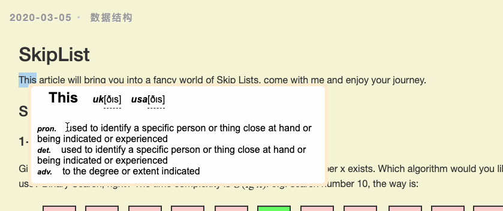

# translator-go-crx
Chrome 浏览器翻译插件



简洁、立即翻译！长句子翻译准确！  
代码简单，后端工程师也可以用来学习和定制化。  

## Brief
这个插件分为两个部分，js和Python：  
js用来安装在Chrome上，负责划词  
Python用来调用翻译API，返回给前端。这样就没有跨域问题，省去很多烦恼。  
搜狗翻译长句子不错，单词接口返回也很丰富。

## Require Environment
nodejs  
python3  

## Install
```
git clone git@github.com:carl-zk/translator-go-crx.git
cd translator-go-crx
npm install
npm run pro
python3 src/backend/app.py
```
Open `chrome://extensions/` add load `dist` directory.

## Other
[dadda](https://github.com/waynecz/dadda-translate-crx)样式漂亮，我一直用它，样式也是模仿它的，可惜搜狗加了跨域验证，过1分钟输一次验证码，很烦人。为什么要自己写个插件呢？因为确实用习惯了，而且我自己没能用js只在前端解决搜狗校验，所以提不了PR给dadda。  

## TODO
加个卡片功能，记单词。  
接个anki？(https://github.com/ninja33/ODH)  
iframe 大杂烩 (https://github.com/crimx/ext-saladict),值得学习  
有意思的一点，上面3个项目都是两年前建的，有点不谋而合。    
（TODO 也可能一直不做）

## Statement
Icons came from Internet, only using for non-commercial.  
Python脚本只用于知识分享，如有人恶意使用，必将受法律严惩！    
  
  
  

觉得不错、有用可以`Star`或`Fork`  
